# Meeting Intelligence Agent (MIA)

A sophisticated multi-agent system for extracting structured insights from meeting transcripts using LangChain, LangSmith, and configurable LLM providers (Ollama, HuggingFace).

## Features

### Core Extraction Capabilities
- **Multi-format Support**: Upload transcripts in TXT, JSON, or SRT format
- **Advanced Preprocessing**: Filler removal, speaker normalization, topic segmentation
- **Flexible Model Strategy**: Choose between Ollama (Llama3) or HuggingFace models
- **Structured Extraction**: Automatically extract decisions, action items, risks, and owners
- **Confidence Scoring**: Each extracted item includes a confidence score
- **Export Options**: Download results as JSON or Markdown

### Evaluation & Quality Assurance (LangChain/LangSmith Integration)
- **Automated LLM-as-a-Judge Evaluation**: Uses Llama3 (via Ollama) or HuggingFace models to evaluate extraction quality
- **Multi-dimensional Scoring**: Evaluates coverage, factuality, clarity, completeness, specificity
- **Human-in-the-Loop Review**: Interactive interface for human reviewers to score and provide feedback
- **Evaluation Aggregation**: Combines LLM, human, and metric-based evaluations with confidence scoring
- **Continuous Improvement**: Tracks low-scoring extractions for retraining
- **LangSmith Observability**: Full tracing and monitoring of evaluation runs
- **Cost Optimization**: Intelligent caching and model fallback strategies

## Tech Stack

### Backend
- **Framework**: Python 3.10+, FastAPI
- **LLM Integration**: LangChain, LangSmith for observability
- **Model Providers**: 
  - Ollama (Llama3.2/Llama3) - Primary evaluation and inference
  - HuggingFace Transformers - Local and remote models
  - Extensible architecture for future providers (OpenAI, Anthropic, etc.)
- **ML Libraries**: Sentence Transformers, scikit-learn, ROUGE, BERTScore
- **Data Processing**: Pandas, NumPy
- **Validation**: Pydantic

### Frontend
- React 18
- TypeScript
- Vite
- Tailwind CSS
- shadcn-ui

## Setup Instructions

### Prerequisites

- Python 3.10 or higher
- Node.js 18+ and npm
- **Ollama** (for Llama3 models) - Install from [ollama.ai](https://ollama.ai)
- Hugging Face account with API token (for remote/hybrid strategies)
- **Optional**: LangSmith API key (for evaluation observability)

### Backend Setup

1. **Clone and navigate to backend directory:**
   ```bash
   cd backend
   ```

2. **Create and activate virtual environment:**
   ```bash
   # Windows
   py -m venv venv
   venv\Scripts\activate

   # Unix/MacOS
   python3 -m venv venv
   source venv/bin/activate
   ```

3. **Install dependencies:**
   ```bash
   pip install -r requirements.txt
   ```

4. **Create `.env` file in backend directory:**
   ```env
   # Core Models
   HUGGINGFACE_TOKEN=your_token_here
   MODEL_STRATEGY=hybrid
   UPLOAD_DIR=./uploads
   OUTPUT_DIR=./outputs
   MAX_FILE_SIZE_MB=50
   SUMMARIZATION_MODEL=philschmid/bart-large-cnn-samsum
   NER_MODEL=dslim/bert-base-NER
   EMBEDDING_MODEL=sentence-transformers/all-MiniLM-L6-v2
   
   # Evaluation Models (LangChain Integration)
   EVALUATION_MODEL_PROVIDER=ollama  # ollama or huggingface
   EVALUATION_MODEL_NAME=llama3.2
   EVALUATION_MODEL_FALLBACK=llama3
   EVALUATION_TEMPERATURE=0.1
   OLLAMA_BASE_URL=http://localhost:11434
   
   # LangSmith Observability (Optional)
   LANGSMITH_API_KEY=your_langsmith_api_key
   LANGSMITH_PROJECT_NAME=mia-evaluations
   ```

5. **Setup Ollama (for evaluation models):**
   ```bash
   # Install Ollama from https://ollama.ai
   
   # Pull the required models
   ollama pull llama3.2
   ollama pull llama3  # fallback model
   
   # Verify Ollama is running
   ollama list
   ```

6. **Start the backend server:**
   ```bash
   uvicorn app.main:app --reload
   ```

   The API will be available at `http://localhost:8000`
   API documentation: `http://localhost:8000/docs`

### Frontend Setup

1. **Navigate to project root (where package.json is located)**

2. **Install dependencies:**
   ```bash
   npm install
   ```

3. **Create `.env` file in project root:**
   ```env
   VITE_API_BASE_URL=http://localhost:8000
   ```

4. **Start the development server:**
   ```bash
   npm run dev
   ```

   The frontend will be available at `http://localhost:5173`

## Documentation

- `docs/guides/`: Hands-on runbooks for setup, testing, troubleshooting, and performance tuning.
- `docs/reference/`: Architecture deep-dives, model notes, prompt fixes, and optimization plans.
- `docs/reports/`: Decision logs, planning outputs, accelerator summaries, and related meeting artifacts.
- `meeting_transcripts/`: Raw transcript inputs retained separately from curated documentation.

## Architecture Overview

### MIA System Flow

The Meeting Intelligence Agent processes transcripts through a multi-stage pipeline with comprehensive evaluation and human feedback loops:

```mermaid
graph TB
    A[📄 Transcript Upload] --> B[🔧 Preprocessing]
    B --> C[🧠 MIA Extraction Pipeline]
    C --> D[📊 Results Display]
    C --> E[🔍 Automated Evaluation]
    E --> F[📈 LangSmith Logging]
    E --> G[👤 Human Review]
    G --> H[🔄 Evaluation Aggregation]
    H --> F
    H --> I[📋 Improvement Reports]
    I --> J[🔄 Model Retraining]

    subgraph "Extraction Components"
        C1[📝 Summary Generation]
        C2[⚖️ Decision Extraction]
        C3[✅ Action Items]
        C4[⚠️ Risk Identification]
    end
    C --> C1
    C --> C2
    C --> C3
    C --> C4

    subgraph "Evaluation Framework"
        E1[🤖 LLM Judge<br/>Llama3.2]
        E2[📊 Traditional Metrics<br/>ROUGE, BERTScore]
        E3[👥 Human Reviewers]
    end
    E --> E1
    E --> E2
    G --> E3

    style A fill:#e1f5fe
    style C fill:#f3e5f5
    style E fill:#fff3e0
    style F fill:#e8f5e8
```



## Usage

1. **Upload a transcript file** (TXT, JSON, or SRT format)
2. **Configure settings:**
   - Model Strategy: Choose local, remote, or hybrid
   - Preprocessing: Choose basic or advanced
3. **Click "Process"** to start analysis
4. **View results** in the output panel with evaluation tabs
5. **Review quality scores** in the evaluation dashboard
6. **Provide human feedback** through the review interface
7. **Export results** as JSON or Markdown

## Extraction and Evaluation Architecture

### Core Extraction Pipeline Overview

The meeting extraction system processes transcripts through a sophisticated multi-stage pipeline that transforms raw meeting data into structured, actionable insights:

```mermaid
graph TB
    subgraph "📥 Input Processing"
        A[📄 Raw Transcript] --> B[🔍 Format Detection<br/>TXT/JSON/SRT]
        B --> C[🧹 Text Cleaning<br/>Remove filler, normalize]
        C --> D[👥 Speaker Attribution<br/>Identify participants]
        D --> E[⏰ Timestamp Parsing<br/>Extract timing info]
    end

    subgraph "🔧 Advanced Preprocessing" 
        E --> F[📊 Semantic Chunking<br/>Topic segmentation]
        F --> G[🔗 Context Building<br/>Cross-references]
        G --> H[📋 Metadata Extraction<br/>Meeting type, duration]
    end

    subgraph "🧠 Multi-Component Extraction"
        H --> I[📝 Summary Pipeline]
        H --> J[⚖️ Decisions Pipeline] 
        H --> K[✅ Action Items Pipeline]
        H --> L[⚠️ Risk Pipeline]
    end

    subgraph "🎯 Quality & Output"
        I --> M[🔍 Confidence Scoring]
        J --> M
        K --> M
        L --> M
        M --> N[📊 Provenance Linking]
        N --> O[📋 Final Results JSON]
    end

    style A fill:#e3f2fd
    style H fill:#f3e5f5
    style M fill:#fff3e0
    style O fill:#e8f5e8
```



### Detailed Extraction Workflows

#### 1. Preprocessing Pipeline

The preprocessing stage transforms raw transcripts into analysis-ready structured data:


#### 2. Component-Specific Extraction Pipelines

Each extraction component follows a specialized pipeline optimized for its specific task:

```mermaid
graph TB
    subgraph "📝 Summary Extraction Pipeline"
        S1[📊 Hierarchical Chunking] --> S2[🧠 Chunk Summarization]
        S2 --> S3[🔄 Recursive Combination]
        S3 --> S4[🎯 Executive Summary]
        S4 --> S5[✅ Quality Gating]
    end

    subgraph "⚖️ Decision Extraction Pipeline"
        D1[🔍 Decision Pattern Detection] --> D2[📊 Confidence Scoring]
        D2 --> D3[✅ Multi-stage Validation]
        D3 --> D4[🔗 Provenance Mapping]
        D4 --> D5[📋 Structured Decision Output]
    end

    subgraph "✅ Action Item Pipeline"
        A1[🎯 Task Identification] --> A2[👤 Owner Extraction]
        A2 --> A3[⏰ Timeline Detection]
        A3 --> A4[📊 Priority Classification]
        A4 --> A5[🔗 Cross-reference Validation]
    end

    subgraph "⚠️ Risk Identification Pipeline"
        R1[🚨 Risk Signal Detection] --> R2[📊 Impact Assessment]
        R2 --> R3[🎯 Likelihood Estimation]
        R3 --> R4[🛠️ Mitigation Identification]
        R4 --> R5[📋 Risk Categorization]
    end

    subgraph "📊 Common Processing Steps"
        CS1[🔍 NER & Entity Linking]
        CS2[⏰ Temporal Extraction]
        CS3[📊 Confidence Calculation]
        CS4[🔗 Provenance Tracking]
    end

    S1 --> CS1
    D1 --> CS1
    A1 --> CS1
    R1 --> CS1
    
    CS1 --> CS2
    CS2 --> CS3
    CS3 --> CS4

    style S1 fill:#e8f5e8
    style D1 fill:#fff3e0
    style A1 fill:#f3e5f5
    style R1 fill:#ffebee
    style CS1 fill:#e1f5fe
```



#### 3. Model Strategy and Orchestration

The system intelligently selects and orchestrates different model types based on the configured strategy:

```mermaid
graph TB
    subgraph "🎛️ Model Strategy Selection"
        A[📊 Model Strategy Config] --> B{Strategy Type?}
        
        B -->|local| C[🏠 Local Models Only]
        B -->|remote| D[☁️ Remote APIs Only] 
        B -->|hybrid| E[🔄 Hybrid Approach]
        B -->|ollama| F[🦙 Ollama/Llama Models]
    end

    subgraph "🏠 Local Processing"
        C --> C1[🧠 Local NER Model<br/>dslim/bert-base-NER]
        C --> C2[📊 Local Embedding<br/>sentence-transformers]
        C --> C3[📝 Local Summarization<br/>philschmid/bart-large-cnn]
        C1 --> C4[💾 No API Calls]
        C2 --> C4
        C3 --> C4
    end

    subgraph "☁️ Remote Processing"
        D --> D1[🌐 HuggingFace API]
        D --> D2[📡 External Models]
        D1 --> D3[💸 API Cost Optimization]
        D2 --> D3
    end

    subgraph "🔄 Hybrid Intelligence"
        E --> E1[🏠 Local: NER + Embeddings]
        E --> E2[☁️ Remote: Complex Summarization]
        E --> E3[🦙 Ollama: Decision Analysis]
        E1 --> E4[⚡ Optimal Performance]
        E2 --> E4
        E3 --> E4
    end

    subgraph "🦙 Ollama Integration"
        F --> F1[🔗 Local Llama3.2/Llama3]
        F --> F2[🚀 High Performance Inference]
        F1 --> F3[💪 Complete Local Control]
        F2 --> F3
    end

    style A fill:#e3f2fd
    style E4 fill:#e8f5e8
    style F3 fill:#fff3e0
    style C4 fill:#f3e5f5
```



#### 4. Provenance and Confidence Tracking

Every extracted item includes comprehensive provenance data linking back to source transcript segments:

```mermaid
graph LR
    subgraph "📋 Source Transcript"
        T1[Segment 1<br/>00:05-01:30]
        T2[Segment 2<br/>01:30-03:15]
        T3[Segment 3<br/>03:15-05:00]
        T4[Segment 4<br/>05:00-07:30]
    end

    subgraph "🔗 Extraction Mapping"
        E1[📝 Summary<br/>Confidence: 0.89]
        E2[⚖️ Decision A<br/>Confidence: 0.92]
        E3[✅ Action Item<br/>Confidence: 0.85]
        E4[⚠️ Risk B<br/>Confidence: 0.78]
    end

    subgraph "📊 Provenance Metadata"
        P1[🔍 Source Segments<br/>Speaker Attribution<br/>Timestamp Range<br/>Context Window]
        P2[📊 Confidence Factors<br/>Pattern Strength<br/>Context Clarity<br/>Validation Score]
        P3[🔗 Cross-references<br/>Related Items<br/>Supporting Evidence<br/>Contradictions]
    end

    T1 --> E1
    T2 --> E1
    T1 --> E2
    T3 --> E2
    T3 --> E3
    T4 --> E4

    E1 --> P1
    E2 --> P1
    E3 --> P1
    E4 --> P1

    E1 --> P2
    E2 --> P2
    E3 --> P2
    E4 --> P2

    P1 --> P3
    P2 --> P3

    style T2 fill:#e3f2fd
    style E2 fill:#f3e5f5
    style P2 fill:#fff3e0
    style P3 fill:#e8f5e8
```



#### 5. Complete Data Flow: Transcript to UI

This diagram shows the complete journey from raw transcript upload to structured results displayed in the UI:


### Implementation Details

The meeting extraction that appears in the UI is produced through the `MeetingExtractor` pipeline defined in `backend/app/extraction/extractor.py`. The system extracts four main components: **Summary**, **Decisions**, **Action Items**, and **Risks**.

### Meeting Summary Pipeline

1. **Transcript preprocessing** (`backend/app/preprocessing/cleaner.py`):
   - `TranscriptCleaner.process` removes greetings, small talk, and filler speech.
   - Consecutive short turns from the same speaker are merged for better context.
   - Speaker names are normalized and (optionally) segments are grouped by topic using embeddings.
   ```text
   Before: "Hey everyone, uh yeah just wanted to kick things off... okay so I think launch is October 15."
   After:  "Just wanted to kick things off. I think launch is October 15."
   ```

2. **Hierarchical summarization** (`MeetingExtractor.extract_summary`):
   - Cleansed transcript is chunked into ~500–700 token windows using semantic chunking when embeddings are available, otherwise a word-based fallback.
   - Each chunk is summarized through `ModelAdapter.summarize`.
   - `_hierarchical_summarize` recursively combines partial summaries into a single narrative.
   ```text
   Before: 1,200-word raw discussion with repeated status updates.
   After:  "The team reviewed launch blockers, confirmed feature readiness, and aligned on timeline adjustments."
   ```

3. **Structured reasoning support** (`MeetingExtractor.extract_structured_data`):
   - Specialized extractors (decisions, actions, risks) in `backend/app/extraction/specialized_extractors.py` analyze the same segments.
   - Provenance tracking anchors each item to supporting transcript spans.
   - Semantic confidence scoring and validation prune low-quality signals and push results to the frontend.
   ```text
   Before: "We’ll push beta two weeks and Alex owns the risk mitigation."
   After:  Decision → "Push beta to Oct 29"; Action → "Alex to drive mitigation plan"; Risk → "Timeline slip if QA fails."
   ```

4. **Executive summary synthesis** (`MeetingExtractor._synthesize_executive_summary`):
   - The initial narrative summary, structured artifacts, and derived metadata (meeting type, duration estimate, main topic) are combined.
   - A templated prompt re-invokes `ModelAdapter.summarize` to ensure required factual elements (dates, metrics, before/after decisions) are present.
   - Result is a polished two to three paragraph executive summary ready for the UI.
   ```text
   Before: "Discussed launch plan and risk mitigation."
   After:  "The planning session was a 45-minute review of the launch program, confirming the move from Oct 15 to Oct 29, highlighting four critical blockers, and assigning three mitigation owners."
   ```

5. **Quality gating** (`MeetingExtractor.process`):
   - Redundancy, coverage, and confidence metrics are calculated for the synthesized summary.
   - If thresholds are not met, the system falls back to the hierarchical summary to avoid hallucinated structure.
   - The UI receives both the final summary and a quality warning flag when confidence is low.

   This pipeline ensures that the displayed meeting summary is grounded in the cleaned transcript, preserves quantitative details, and aligns with the structured outputs surfaced elsewhere in the app.

### Decisions Extraction Pipeline

The decisions extraction process (`backend/app/extraction/specialized_extractors.py`) identifies concrete decisions made during meetings:

1. **Enhanced Decision Detection** (`EnhancedDecisionExtractor.extract_decisions`):
   - Uses semantic analysis to identify decision-making language patterns
   - Employs confidence scoring based on contextual indicators
   ```text
   Before: "I think we should probably go with option A, what do you all think?"
   After:  Decision → "Selected option A" (Confidence: 0.7) + Rationale + Timeline context
   ```

2. **Multi-stage Validation** (`DecisionValidator.validate_decision`):
   - Checks for specificity, actionability, and temporal grounding
   - Filters out discussions vs. actual decisions
   ```text
   Before: "We discussed the budget and timeline extensively"
   After:  [Filtered out - no concrete decision identified]
   ```

3. **Provenance Linking** (`ProvenanceTracker.link_to_segments`):
   - Maps each decision back to specific transcript segments
   - Provides explainability for extraction confidence
   ```text
   Decision: "Move launch to Q2 2024" → Linked to segments [15:30-16:45] with speaker attribution
   ```

### Action Items Extraction Pipeline

Action items extraction (`ActionItemExtractor.extract_action_items`) identifies specific tasks and assignments:

1. **Task Identification**:
   - Detects action-oriented language: "will", "should", "needs to", "assigned to"
   - Separates commitments from general discussions
   ```text
   Before: "Sarah mentioned she might look into the API integration sometime next week"
   After:  Action → "Sarah to investigate API integration" (Deadline: next week, Confidence: 0.6)
   ```

2. **Owner and Timeline Extraction**:
   - Uses NER and temporal extraction to identify assignees and deadlines
   - Handles implicit and explicit assignments
   ```text
   Before: "Let's have someone check the database performance by Friday"
   After:  Action → "Check database performance" (Owner: [Unassigned], Deadline: Friday, Priority: Medium)
   ```

3. **Priority Classification**:
   - Infers urgency from context and language cues
   - Classifies as High, Medium, or Low priority
   ```text
   Before: "This is critical - we need to fix the security issue immediately"
   After:  Action → "Fix security issue" (Priority: High, Urgency: Immediate)
   ```

### Risk Identification Pipeline

Risk extraction (`RiskExtractor.extract_risks`) identifies potential issues and concerns:

1. **Risk Pattern Recognition**:
   - Detects risk indicators: "concern", "problem", "issue", "blocker", "risk"
   - Distinguishes between current problems and potential risks
   ```text
   Before: "If the API changes, we might have compatibility issues with the mobile app"
   After:  Risk → "API compatibility issues with mobile app" (Impact: High, Likelihood: Medium)
   ```

2. **Impact and Likelihood Assessment**:
   - Uses contextual analysis to estimate potential impact
   - Assesses probability based on discussion tone and context
   ```text
   Before: "The vendor might delay delivery, which would push our timeline back significantly"
   After:  Risk → "Vendor delivery delay" (Impact: High, Likelihood: Medium, Mitigation: [Identified backup plans])
   ```

3. **Mitigation Tracking**:
   - Identifies proposed or discussed mitigation strategies
   - Links risks to related action items for resolution
   ```text
   Risk: "Database performance degradation" → Linked to Action: "Database performance audit by John"
   ```

### LangChain/LangSmith Evaluation Framework

The evaluation system (`backend/app/evaluation/`) uses LangChain to implement a comprehensive quality assessment framework:

#### 1. Automated LLM-as-a-Judge Evaluation

**Implementation**: `evaluation_chain.py` - `EvaluationChain`
```python
# Example evaluation prompt for summary assessment
prompt = """
You are an expert evaluator for meeting summaries. Given the original transcript 
and a generated summary, evaluate it based on these criteria:

- Coverage: How comprehensively the summary covers key discussion points
- Factuality: How accurately the summary reflects the actual conversation  
- Clarity: How clear and understandable the summary is

Return scores (0-10) and explanations for each criterion.
"""
```

**Model Configuration**: Uses Ollama with Llama3.2 by default, with fallback to HuggingFace models
```text
Before: Raw extraction results without quality assessment
After:  Each component scored on multiple dimensions with explanations
        Summary: Coverage=8.5, Factuality=9.0, Clarity=7.5 + detailed rationale
```

#### 2. Multi-Dimensional Scoring System

**Implementation**: `evaluation_schema.json` defines evaluation criteria
```json
{
  "summary": ["coverage", "factuality", "clarity"],
  "decisions": ["specificity", "completeness", "clarity"],
  "action_items": ["owner", "timeline", "clarity", "priority"],
  "risks": ["impact", "likelihood", "specificity"]
}
```

**Before/After Example**:
```text
Before: Basic confidence scores (0.7, 0.8, 0.9)
After:  Structured evaluation:
        - Decisions: Specificity=8.2, Completeness=7.8, Clarity=9.1
        - Human-interpretable quality assessment with improvement recommendations
```

#### 3. Human-in-the-Loop Review System

**Implementation**: `HumanReviewForm.tsx` + `evaluation_routes.py`
- Interactive sliders for criterion-based scoring
- Side-by-side comparison of extracted content vs. ground truth
- Free-text explanations and feedback collection
- "Mark for retraining" functionality for continuous improvement

```text
Before: No human feedback mechanism
After:  Reviewers can score each extraction component, provide explanations,
        and flag poor examples for model improvement
```

#### 4. Evaluation Aggregation and Confidence Scoring

**Implementation**: `evaluation_aggregator.py` - `EvaluationAggregator`
```python
# Weighted combination of LLM, human, and metric-based scores
final_score = 0.4 * llm_score + 0.4 * human_score + 0.2 * metrics_score
confidence = "high" if llm_human_agreement > 0.8 else "medium" if > 0.6 else "low"
```

**Before/After Example**:
```text
Before: Single confidence score per extraction
After:  Comprehensive evaluation:
        - Aggregate Score: 8.3/10 (High Confidence)  
        - Agreement Level: High (LLM-Human delta < 1.0)
        - Sources: [LLM, Human, Metrics] with transparent weights
```

#### 5. LangSmith Observability and Monitoring

**Implementation**: `evaluation_runner.py` with LangChain callbacks
- Automatic logging of all evaluation runs to LangSmith
- Performance tracking across model versions
- Cost monitoring and optimization insights
- Evaluation trend analysis and regression detection

```text
Before: No visibility into evaluation process or performance trends
After:  Full observability:
        - Evaluation runs tracked in LangSmith dashboard
        - Model performance trends over time
        - Cost analysis per evaluation type
        - Automated regression detection
```

#### 6. Traditional Metrics Integration

**Implementation**: `metrics_evaluator.py` - `MetricsEvaluator`
- **ROUGE Scores**: For summary quality assessment
- **BERTScore**: For semantic similarity measurement  
- **Precision/Recall/F1**: For extraction completeness
- **Coverage Metrics**: For information retention analysis

```text
Before: Only LLM-based subjective evaluation
After:  Combined evaluation approach:
        - ROUGE-L F1: 0.67 (summary overlap with reference)
        - BERTScore: 0.82 (semantic similarity)  
        - Decision Recall: 0.89 (completeness)
        - Overall Quality: 8.4/10 (aggregated score)
```

### Configuration-Driven Model Selection

The system supports plug-and-play model configuration across all components:

#### Evaluation Model Configuration
```bash
# Use Ollama/Llama3 (recommended)
EVALUATION_MODEL_PROVIDER=ollama
EVALUATION_MODEL_NAME=llama3.2

# Use HuggingFace models
EVALUATION_MODEL_PROVIDER=huggingface  
EVALUATION_MODEL_NAME=microsoft/DialoGPT-large

# Future extensibility: OpenAI support available but not currently used
# EVALUATION_MODEL_PROVIDER=openai
# EVALUATION_MODEL_NAME=gpt-4o-mini
```

#### Extraction Model Configuration
```bash
# Core extraction models
MODEL_STRATEGY=hybrid  # local, remote, hybrid, ollama
SUMMARIZATION_MODEL=philschmid/bart-large-cnn-samsum
NER_MODEL=dslim/bert-base-NER
EMBEDDING_MODEL=sentence-transformers/all-MiniLM-L6-v2
```

This architecture ensures that changing model providers requires only configuration updates, with automatic fallback handling and comprehensive error recovery.

## Detailed System Workflows

### Evaluation Pipeline Flow

The evaluation system provides multi-layered quality assessment with automated scoring, human review, and continuous improvement:


### Human-in-the-Loop Review Process

The human review system enables subject matter experts to provide feedback and improve model performance:


### API Endpoints for Evaluation

The system provides RESTful API endpoints for evaluation management:

#### Core Evaluation Endpoints
```bash
# Trigger evaluation for a processed job
POST /api/evaluation/{job_id}/trigger
{
  "include_llm": true,
  "include_metrics": true,
  "reference_data": {...}  # optional ground truth
}

# Get evaluation status and results
GET /api/evaluation/{job_id}/status

# Submit human review
POST /api/evaluation/{job_id}/human-review  
{
  "component": "summary",
  "scores": {"coverage": 8, "factuality": 9, "clarity": 7},
  "explanations": {"coverage": "Missing key decision details"},
  "mark_for_retraining": false
}

# Get evaluation schema (for frontend)
GET /api/evaluation/schema

# Get model configuration info
GET /api/evaluation/model-info
```

#### Evaluation Dashboard Integration
```bash
# List evaluation jobs by status
GET /api/evaluation/jobs/{status}?limit=20&offset=0

# Batch evaluation for multiple jobs  
POST /api/evaluation/batch
{
  "job_ids": ["job1", "job2", "job3"],
  "parallel": true
}

# Get retraining candidates (flagged by reviewers)
GET /api/evaluation/retraining-candidates
```

### Usage Example: End-to-End Evaluation Flow

1. **Process a transcript** through the main MIA pipeline
2. **Trigger evaluation** automatically or manually
3. **Review results** in the evaluation dashboard
4. **Submit human feedback** through the review interface  
5. **Monitor trends** in LangSmith for continuous improvement

```python
# Example programmatic usage
import requests

# Step 1: Process transcript
response = requests.post("/api/process/{upload_id}")
job_id = response.json()["job_id"]

# Step 2: Trigger evaluation  
requests.post(f"/api/evaluation/{job_id}/trigger")

# Step 3: Check evaluation status
eval_status = requests.get(f"/api/evaluation/{job_id}/status").json()
print(f"Aggregate Score: {eval_status['aggregated_evaluation']['aggregate_score']}")

# Step 4: Submit human review
review_data = {
    "component": "summary", 
    "scores": {"coverage": 8, "factuality": 9, "clarity": 7},
    "explanations": {"coverage": "Good coverage of main points"}
}
requests.post(f"/api/evaluation/{job_id}/human-review", json=review_data)
```

## Model Strategy Options

- **Hybrid** (Recommended): Uses local models for extraction, HF API for summarization
- **Local**: Runs all models locally (requires GPU for best performance)
- **Remote**: Uses Hugging Face Inference API for all tasks

## Project Structure

```
.
├── backend/
│   ├── app/
│   │   ├── api/               # FastAPI routes
│   │   │   ├── routes.py      # Core MIA processing endpoints
│   │   │   ├── model_management.py  # Model management endpoints  
│   │   │   └── evaluation_routes.py # Evaluation/review endpoints
│   │   ├── config/            # Configuration settings
│   │   │   ├── settings.py    # Application settings
│   │   │   └── evaluation_schema.json  # Evaluation criteria schema
│   │   ├── extraction/        # Information extraction pipeline
│   │   │   ├── extractor.py   # Main extraction orchestrator
│   │   │   ├── specialized_extractors.py  # Component-specific extractors
│   │   │   ├── enhanced_decision_extractor.py  # Advanced decision logic
│   │   │   ├── provenance.py  # Transcript linking and attribution
│   │   │   └── validator.py   # Extraction quality validation
│   │   ├── evaluation/        # LangChain/LangSmith evaluation framework
│   │   │   ├── evaluation_chain.py      # LLM-as-judge evaluation
│   │   │   ├── evaluation_runner.py     # Evaluation orchestration
│   │   │   ├── evaluation_aggregator.py # Multi-source score aggregation
│   │   │   ├── metrics_evaluator.py     # Traditional metrics (ROUGE, BERTScore)
│   │   │   └── model_adapter.py         # Pluggable LLM providers
│   │   ├── models/            # Model adapters
│   │   │   ├── adapter.py     # Core model abstraction
│   │   │   ├── ollama_adapter.py  # Ollama/Llama integration
│   │   │   └── model_manager.py   # Model lifecycle management
│   │   ├── preprocessing/     # Transcript preprocessing
│   │   │   ├── cleaner.py     # Text cleaning and normalization
│   │   │   ├── enhanced_pipeline.py  # Advanced preprocessing
│   │   │   └── parser.py      # Multi-format transcript parsing
│   │   ├── utils/             # Utility functions
│   │   │   └── storage.py     # File and result management
│   │   └── main.py            # FastAPI app entry point
│   ├── tests/
│   ├── uploads/               # Uploaded transcript files
│   └── outputs/               # Processing results + evaluation reports
├── src/
│   ├── components/            # React components
│   │   ├── MIAOutput.tsx      # Main results display (with evaluation tabs)
│   │   ├── EvaluationDashboard.tsx    # Evaluation metrics visualization
│   │   ├── HumanReviewForm.tsx        # Human-in-the-loop review interface
│   │   ├── EnhancedDecisionCard.tsx   # Decision display with provenance
│   │   └── [other components]
│   ├── services/              # API service client
│   │   └── miaService.ts      # Backend API integration
│   ├── pages/                 # Page components
│   └── types/                 # TypeScript types
├── meeting_transcripts/       # Sample transcripts for testing
└── venv/                      # Python virtual environment (git-ignored)
```

## Development

### Running Tests

```bash
# Backend tests
cd backend
pytest

# Frontend tests (if configured)
npm test
```

### Building for Production

```bash
# Frontend
npm run build

# Backend (using Docker)
docker build -t mia-backend ./backend
```

## Notes

- Models are cached locally in `backend/models_cache/` to avoid repeated downloads
- First run may take longer as models are downloaded
- For best performance with local models, a GPU is recommended
- Free Hugging Face API tier has rate limits

## LangSmith Integration and Monitoring

LangSmith provides comprehensive observability for the MIA evaluation system, enabling continuous improvement and performance monitoring.

### LangSmith Dashboard Overview


### Setting Up LangSmith Monitoring

#### 1. **Initial Configuration**

```bash
# Add to your .env file
LANGSMITH_API_KEY=your_langsmith_api_key
LANGSMITH_PROJECT_NAME=mia-evaluations

# Verify connection
curl -X GET "http://localhost:8000/api/evaluation/model-info"
```

#### 2. **What Gets Logged to LangSmith**

```mermaid
graph LR
    subgraph "Evaluation Data Flow"
        A[🧠 LLM Evaluations] --> E[📊 LangSmith Run]
        B[📊 Traditional Metrics] --> E
        C[👤 Human Reviews] --> E
        D[🔀 Aggregated Scores] --> E
    end

    subgraph "LangSmith Run Contains"
        E --> F[📋 Run Metadata<br/>• Job ID<br/>• Timestamp<br/>• Model Info]
        E --> G[📊 Input Data<br/>• Original Transcript<br/>• Extraction Results<br/>• Reference Data]
        E --> H[📈 Output Scores<br/>• Component Scores<br/>• Explanations<br/>• Confidence Levels]
        E --> I[🏷️ Tags<br/>• mia<br/>• evaluation<br/>• automated]
    end

    style E fill:#e1f5fe
    style F fill:#f3e5f5
    style G fill:#fff3e0
    style H fill:#e8f5e8
    style I fill:#fce4ec
```



### Using LangSmith for Continuous Improvement

#### Performance Monitoring Dashboard

1. **Navigate to LangSmith**: https://smith.langchain.com/
2. **Select Project**: `mia-evaluations`
3. **Monitor Key Metrics**:

```mermaid
graph TB
    A[🎯 Evaluation Quality Metrics] --> A1[📊 Average Scores by Component]
    A --> A2[📈 Score Trends Over Time]
    A --> A3[🎯 Pass/Fail Rate by Threshold]
    
    B[⚡ Performance Metrics] --> B1[⏱️ Evaluation Latency]
    B --> B2[🔄 Throughput (Evaluations/hour)]
    B --> B3[💰 Cost per Evaluation]
    
    C[🔍 Quality Insights] --> C1[📋 Low-Scoring Patterns]
    C --> C2[🚨 Common Failure Points]
    C --> C3[💡 Improvement Opportunities]
    
    D[🤖 Model Performance] --> D1[🎯 LLM vs Human Agreement]
    D --> D2[📊 Confidence Calibration]
    D --> D3[🔄 Model Drift Detection]

    style A fill:#e8f5e8
    style B fill:#fff3e0
    style C fill:#f3e5f5
    style D fill:#e1f5fe
```

#### Identifying Improvement Opportunities

**Step-by-Step Analysis Process:**

1. **Filter by Low Scores**:
   ```
   LangSmith Filter: aggregate_score < 6.0
   ```

2. **Analyze Patterns**:
   - Which components consistently score low?
   - Are there specific meeting types with issues?
   - Do certain topics perform worse?

3. **Review LLM Explanations**:
   ```json
   {
     "explanations": {
       "coverage": "Summary misses key decisions discussed in minutes 15-20",
       "factuality": "Incorrect attribution of action item to wrong person"
     }
   }
   ```

4. **Cross-Reference with Human Reviews**:
   ```mermaid
   graph LR
       A[🤖 LLM Score: 5.2] --> C[❓ Disagreement Analysis]
       B[👤 Human Score: 8.1] --> C
       C --> D[🔍 Root Cause Investigation]
       D --> E[🛠️ Prompt Refinement]
       D --> F[📊 Model Retraining]
       D --> G[📋 Process Improvement]
   ```

### Advanced LangSmith Features for MIA

#### Custom Evaluations and A/B Testing


#### Setting Up Custom Evaluations

1. **Create Evaluation Dataset**:
   ```python
   # In LangSmith UI or via API
   evaluation_dataset = {
       "name": "mia-golden-set",
       "examples": [
           {
               "transcript": "Meeting transcript...",
               "expected_summary": "Gold standard summary...",
               "expected_decisions": [...]
           }
       ]
   }
   ```

2. **Monitor Model Performance**:
   ```bash
   # Trigger batch evaluation
   curl -X POST "http://localhost:8000/api/evaluation/batch" \
     -H "Content-Type: application/json" \
     -d '{"job_ids": ["job1", "job2", "job3"], "parallel": true}'
   ```

### Cost Optimization with LangSmith

```mermaid
graph TB
    A[💰 Cost Monitoring] --> B[📊 Usage Analytics]
    B --> C[🎯 Optimization Strategies]
    
    subgraph "Cost Components"
        D[🤖 LLM Evaluation Calls]
        E[📊 Traditional Metrics]
        F[💾 Storage Costs]
        G[🔄 API Requests]
    end
    
    B --> D
    B --> E
    B --> F
    B --> G
    
    C --> H[⚡ Smart Caching<br/>Skip duplicate evaluations]
    C --> I[🎯 Selective Evaluation<br/>Focus on low-confidence items]
    C --> J[📊 Batch Processing<br/>Reduce API overhead]
    C --> K[🔄 Model Fallbacks<br/>Use cheaper models when appropriate]
    
    style A fill:#fff3cd
    style H fill:#d4edda
    style I fill:#d4edda
    style J fill:#d4edda
    style K fill:#d4edda
```



### Troubleshooting LangSmith Integration

#### Common Issues and Solutions

| Issue | Symptoms | Solution |
|-------|----------|----------|
| 🚫 No data in dashboard | Empty project view | Check API key configuration and network connectivity |
| ⚠️ Incomplete runs | Missing evaluation data | Verify all evaluation components are completing successfully |
| 💰 High costs | Unexpected billing | Enable caching and implement selective evaluation |
| 🐌 Slow performance | Long evaluation times | Use batch processing and parallel evaluation |

#### Monitoring Checklist

- [ ] ✅ Evaluation runs appearing in dashboard
- [ ] 📊 All metadata fields populated correctly  
- [ ] 🎯 Quality scores within expected ranges
- [ ] 💰 Cost tracking enabled and monitored
- [ ] 🚨 Error alerts configured for failed evaluations
- [ ] 📈 Weekly performance review scheduled

## License

[Your License Here]
